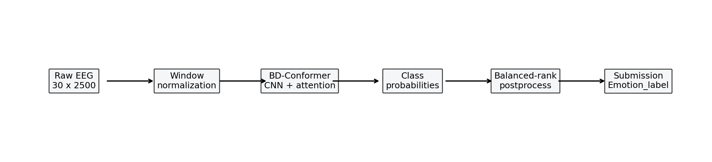
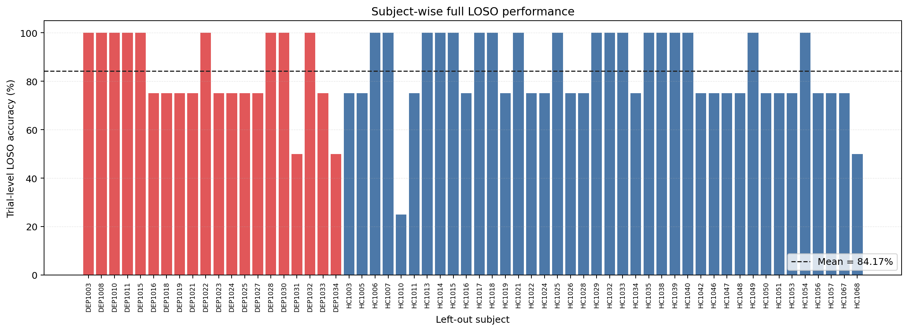
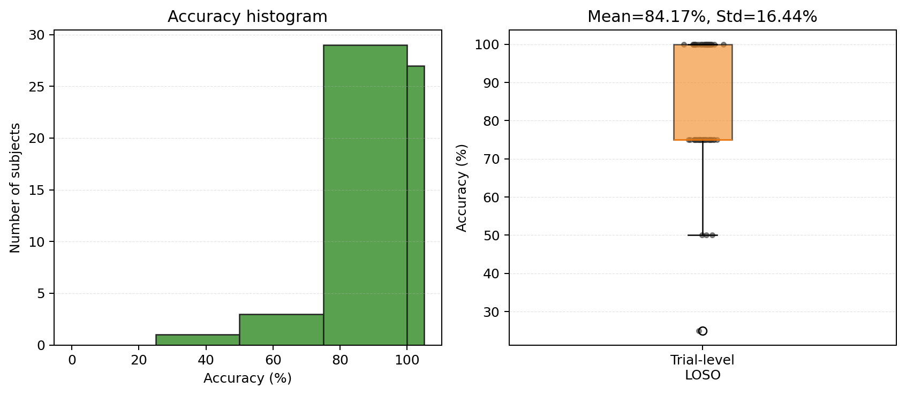
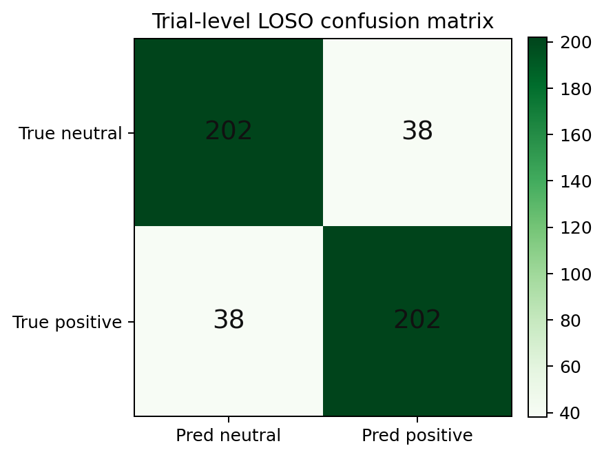

# 基于 EEG-Conformer 与类别先验后处理的跨被试脑电情绪识别方法研究

## 摘要

本文面向 30 通道 EEG 跨被试情绪二分类任务，区分中性与积极情绪。方法采用 BD-Conformer 建模原始 EEG 窗口，并结合 window normalization 与 balanced-rank 后处理。训练集 full LOSO 中，窗口级准确率为 73.80%，trial-level 聚合准确率为 84.17%。公开测试集仅用于生成 submission。

## 1. 引言

EEG 能反映神经活动，但跨被试识别受低信噪比、个体差异和小样本限制。传统 DE+SVM 难以描述时空依赖。本文使用 EEG-Conformer 学习原始信号，并利用公开 4/4 trial 类别比例约束输出。

## 2. 数据集

训练集包含 60 名被试，其中健康 40 名、抑郁症 20 名。每名被试含 4 段中性视频和 4 段积极视频，标签为 0/1。公开测试集含 10 名被试，真实标签隐藏。

## 3. 方法

### 3.1 方法流程

整体流程如图 1。原始 EEG 切分为 10 秒窗口并标准化，随后输入 BD-Conformer 输出类别概率，最后按同一被试 4/4 类别比例执行 balanced-rank。



核心思路是：使用 raw EEG；用 Conformer 学习时空依赖；用公开类别比例约束预测分布，且不涉及测试集真实标签。

### 3.2 数据预处理

训练 trial 约 50 秒，切为 10 秒窗口，长度 2500，stride 1250，每个 trial 得到 9 个窗口。window normalization 按窗口和通道标准化。

```python
def standardize_by_window(X: np.ndarray, eps: float = 1e-6) -> np.ndarray:
    mean = X.mean(axis=-1, keepdims=True).astype(np.float32)
    std = X.std(axis=-1, keepdims=True).astype(np.float32)
    std = np.maximum(std, eps)
    return ((X - mean) / std).astype(np.float32, copy=False)
```

### 3.3 BD-Conformer 模型

本文使用 Braindecode 的 EEGConformer。模型输入为 `30 x 2500` EEG 窗口，输出两类 logits；卷积提取局部模式，自注意力建模依赖。

当前项目中 BD-Conformer 的模型构建代码如下：

```python
from braindecode.models import EEGConformer

def make_bd_conformer_kwargs(args, cfg, window_size, signature_parameters=None):
    params = set(signature_parameters or inspect.signature(EEGConformer).parameters)
    kwargs = {
        "n_chans": cfg["signal"]["n_channels"],
        "n_times": window_size,
        "sfreq": cfg["signal"]["sample_rate"],
        "n_outputs": 2,
        "drop_prob": args.dropout,
        "att_drop_prob": args.dropout,
    }
    if "num_layers" in params:
        kwargs["num_layers"] = args.num_layers
    else:
        kwargs["att_depth"] = args.num_layers
    if "num_heads" in params:
        kwargs["num_heads"] = args.num_heads
    else:
        kwargs["att_heads"] = args.num_heads
    return kwargs
```

### 3.4 Balanced-rank 后处理

balanced-rank 在每名被试的 8 个 trial 内按积极类概率排序，取最高 4 个为积极类，其余为中性类。

```python
def balanced_rank_predictions(probas):
    probas = np.asarray(probas)
    n_positive = probas.shape[0] // 2
    preds = np.zeros(probas.shape[0], dtype=np.int64)
    positive_rank = np.argsort(probas[:, 1], kind="mergesort")
    preds[positive_rank[-n_positive:]] = 1
    return preds
```

### 3.5 Trial-level balanced-rank

trial-level 方法先平均同一 trial 的 9 个窗口概率，再执行 balanced-rank，主要用于训练集验证。

```python
def trial_balanced_rank_predictions(probas, windows_per_trial):
    trial_probas = probas.reshape(-1, windows_per_trial, probas.shape[1]).mean(axis=1)
    trial_preds = balanced_rank_predictions(trial_probas)
    return np.repeat(trial_preds, windows_per_trial)
```

## 4. 实验设置

本文采用 full LOSO：每折留出 1 名被试验证，其余 59 名训练。

| 参数 | 设置 |
|---|---|
| 模型 | BD-Conformer |
| 输入 | Raw EEG, `30 x 2500` |
| 窗口长度 | 10s |
| 训练 stride | 5s |
| 标准化 | Window normalization |
| Dropout | 0.5 |
| Epochs | 20 |
| Early stopping patience | 3 |
| 后处理 | balanced-rank / trial-balanced-rank |
| 评估方式 | Full LOSO |

准确率计算公式如下：

```text
单折准确率 = 预测正确的样本数 / 该折验证样本总数
Full LOSO Accuracy = (1 / N) * Σ_i Accuracy_i
```

其中 `N=60`。窗口级样本为 72 个 EEG 窗口，trial-level 样本为 8 个 trial。

## 5. 实验结果与可视化

结果均来自训练集 full LOSO。公开测试集无真实标签，不能计算准确率或混淆矩阵。

### 5.1 被试级 LOSO 结果

图 2 展示 60 名训练被试的 trial-level LOSO 准确率。部分被试达到 100%，少数低于 50%，说明个体差异明显。



### 5.2 准确率分布

图 3 展示准确率分布。trial-level 平均准确率为 84.17%，标准差为 16.44%，说明稳定性仍有限。



### 5.3 Trial-level LOSO 混淆矩阵

图 4 为训练集 trial-level full LOSO 混淆矩阵，不是公开测试集结果。



## 6. 讨论

BD-Conformer 利用原始 EEG 时空结构，window normalization 缓解尺度差异，balanced-rank 利用公开比例提升稳定性。本文未使用测试集标签；测试集只用于无标签推理和 Excel submission。

## 7. 结论

本文提出 BD-Conformer + window normalization + balanced-rank 方法。窗口级 full LOSO 为 73.80%，trial-level 聚合为 84.17%，说明深度时空模型结合公开先验可提升 EEG 情绪识别效果。

## 代码仓库

base URL：<https://github.com/Harry050118/brain_interface.git>
