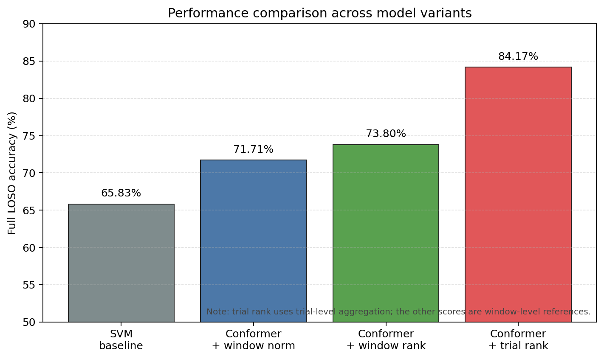
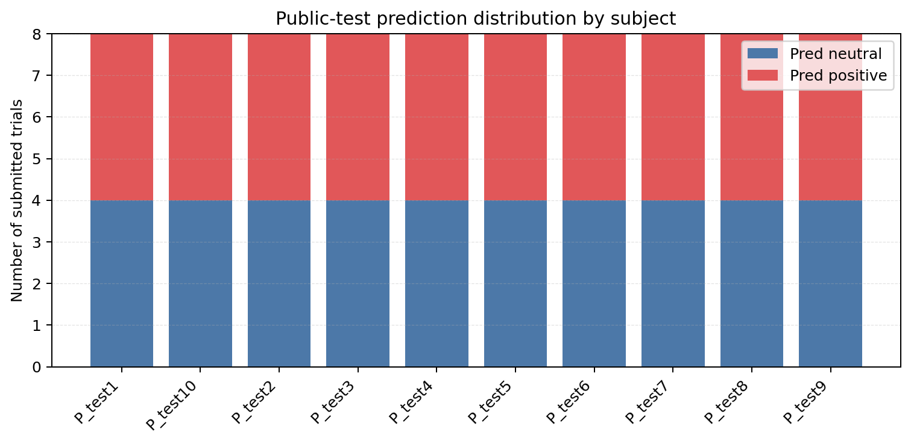

# 基于 EEG-Conformer 与类别先验后处理的跨被试脑电情绪识别方法研究

## 摘要

本文面向“基于脑电数据的情绪识别算法”赛题，研究跨被试条件下的脑电情绪二分类任务，即根据 30 通道 EEG 信号识别积极情绪与中性情绪。脑电情绪识别面临个体差异显著、训练样本规模有限、信号噪声较高等挑战。针对这些问题，本文构建了基于原始 EEG 的 EEG-Conformer 分类模型，并结合窗口级标准化与基于实验设计先验的 balanced-rank 后处理策略。模型输入为 30 通道、10 秒长度的 EEG 片段，通过卷积模块与自注意力模块学习空间-时间特征。实验采用 leave-one-subject-out（LOSO）跨被试验证。结果显示，BD-Conformer 结合窗口级标准化与窗口级 balanced-rank 后处理在 full LOSO 上达到 73.80%；进一步地，在训练集 trial-level 评估中，将同一 50 秒视频段切分得到的多个 10 秒窗口概率进行平均，再进行 trial-level balanced-rank 后处理，full LOSO 准确率达到 84.17%。需要注意的是，trial-level 结果利用了训练集中 50 秒 trial 的多窗口聚合信息，而公开测试集每个 trial 仅提供 10 秒数据，因此本文同时报告窗口级结果作为更保守的泛化参考。

## 1. 引言

脑电情绪识别（EEG-based emotion recognition）旨在利用脑电信号判断被试的情绪状态。与表情、语音等外显行为信号相比，EEG 能够更直接地反映大脑神经活动，具有一定客观性和难伪装性。然而，EEG 信号也存在信噪比低、跨被试差异大、可用样本规模有限等问题，使跨被试情绪识别成为较难的分类任务。

传统 EEG 情绪识别方法通常先提取频域、熵类或空间不对称特征，再使用 SVM、随机森林等机器学习模型进行分类。该类方法解释性较强，但对特征工程依赖较高，难以充分建模原始 EEG 的时空结构。近年来，卷积神经网络和 Transformer 结构逐渐被用于 EEG 建模，其中 EEG-Conformer 结合卷积模块与自注意力模块，能够同时捕获局部时空模式和较长程依赖关系。

本文最终采用 Braindecode 中实现的 EEGConformer 作为主模型，并在模型输出后加入基于赛题公开数据结构的后处理。根据数据说明文档，每名被试包含 4 段中性视频和 4 段积极视频，因此本文对同一被试的 8 个 trial 按积极类概率进行排序，选取概率最高的 4 个 trial 作为积极类，其余作为中性类。该策略不使用测试集标签，仅使用公开实验设计先验。

本文主要贡献如下：

1. 使用 BD-Conformer 对原始 30 通道 EEG 窗口进行端到端建模。
2. 使用窗口级标准化降低被试间幅值差异。
3. 基于每名被试 4 个积极 trial 和 4 个中性 trial 的公开先验，设计 balanced-rank 和 trial-level balanced-rank 后处理。
4. 在 full LOSO 设置下同时报告窗口级和 trial-level 结果，区分保守泛化评估和 trial 聚合评估。

## 2. 数据集与任务定义

根据赛题数据说明文档，训练集包含健康被试 40 名和抑郁症被试 20 名，共 60 名被试。每名被试观看 8 段情绪视频，包括 4 段中性情绪视频和 4 段积极情绪视频。训练集中每名被试的 EEG 数据保存为一个 `.mat` 文件，其中 `EEG_data_neu` 表示中性情绪，标签定义为 0；`EEG_data_pos` 表示积极情绪，标签定义为 1。每类 EEG 数据维度为 `30 x 50000`，对应 4 段约 50 秒视频，采样率为 250 Hz。

公开测试集包含 10 名被试，其中健康被试 5 名、抑郁症被试 5 名。每名被试同样包含 8 个 trial，其中 4 个为中性情绪、4 个为积极情绪，但顺序随机且真实标签不公开。测试集中每名被试的 EEG 数据维度为 `30 x 20000`，对应 8 个 10 秒 trial。最终提交要求为每个 `user_id` 和 `trial_id` 输出一个 `Emotion_label`。

| 数据集 | 被试数 | 每名被试 trial 数 | 类别比例 | 单个 trial 长度 | 标签状态 |
|---|---:|---:|---:|---:|---|
| 训练集 | 60 | 8 | 4 中性 / 4 积极 | 约 50s | 公开 |
| 公开测试集 | 10 | 8 | 4 中性 / 4 积极 | 10s | 隐藏 |

## 3. 方法

### 3.1 方法流程

本文整体流程如图 1 所示。首先将原始 EEG 切分为固定长度窗口，并进行窗口级标准化；随后使用 BD-Conformer 输出每个窗口或 trial 的类别概率；最后根据每名被试 4/4 的类别比例先验进行 balanced-rank 后处理，生成最终提交标签。


### 3.2 数据预处理

训练集中每段视频约为 50 秒，对应 `12500` 个采样点。本文将其切分为 10 秒 EEG 窗口，即每个窗口包含 `2500` 个采样点；训练 stride 设置为 5 秒，即 `1250` 个采样点。因此，每个 50 秒 trial 可切分为 9 个重叠窗口。每个窗口的输入维度为 `30 x 2500`。

为了降低不同被试之间信号幅值和尺度差异，本文采用窗口级标准化。该方法对每个 EEG 窗口内的每个通道沿时间维度分别计算均值和标准差，并进行标准化。

核心代码如下：

```python
def standardize_by_window(X: np.ndarray, eps: float = 1e-6) -> np.ndarray:
    """Apply per-window, per-channel normalization across time."""
    if X.ndim != 3:
        raise ValueError(f"Expected X shape (n, channels, time), got {X.shape}")
    mean = X.mean(axis=-1, keepdims=True).astype(np.float32)
    std = X.std(axis=-1, keepdims=True).astype(np.float32)
    std = np.maximum(std, eps)
    return ((X - mean) / std).astype(np.float32, copy=False)
```

### 3.3 BD-Conformer 模型

本文使用 Braindecode 中的 EEGConformer 作为主模型。EEGConformer 结合卷积结构与自注意力结构，其中卷积模块用于提取局部时空特征，自注意力模块用于建模较长程依赖关系。模型输入为原始 EEG 窗口，输出为中性和积极两类的 logits。

核心模型构建逻辑如下：

```python
from braindecode.models import EEGConformer

model = EEGConformer(
    n_chans=cfg["signal"]["n_channels"],
    n_times=window_size,
    sfreq=cfg["signal"]["sample_rate"],
    n_outputs=2,
    drop_prob=args.dropout,
    att_drop_prob=args.dropout,
)
```

训练时采用 AdamW 优化器，损失函数为交叉熵损失。主要实验使用 dropout 0.5、训练 20 个 epoch，并采用 early stopping。

### 3.4 Balanced-rank 后处理

根据数据说明文档，每名被试包含 4 段中性视频和 4 段积极视频。本文利用这一公开实验设计先验，在模型输出概率后加入 balanced-rank 后处理：对同一被试的 8 个 trial 按积极类概率从低到高排序，选择积极类概率最高的 4 个 trial 作为积极类，其余作为中性类。

该策略没有使用公开测试集真实标签，也没有根据提交反馈反推标签；它仅利用数据说明文档中公开的类别比例先验。

核心代码如下：

```python
def balanced_rank_predictions(probas):
    """Predict exactly half positive samples by positive-class probability rank."""
    probas = np.asarray(probas)
    if probas.ndim != 2 or probas.shape[1] != 2:
        raise ValueError(f"Expected probability shape (n, 2), got {probas.shape}")
    n_positive = probas.shape[0] // 2
    preds = np.zeros(probas.shape[0], dtype=np.int64)
    if n_positive == 0:
        return preds
    positive_rank = np.argsort(probas[:, 1], kind="mergesort")
    preds[positive_rank[-n_positive:]] = 1
    return preds
```

### 3.5 Trial-level balanced-rank

在训练集 LOSO 验证中，每个 50 秒 trial 会被切分为 9 个 10 秒窗口。为了让验证指标更接近视频 trial 级别的任务单位，本文进一步采用 trial-level balanced-rank：先将同一 trial 的 9 个窗口预测概率进行平均，得到 trial 级概率，再对同一被试的 8 个 trial 进行 balanced-rank。

核心代码如下：

```python
def trial_balanced_rank_predictions(probas, windows_per_trial):
    """Aggregate consecutive windows to trials, then rank trials with a balanced prior."""
    probas = np.asarray(probas)
    windows_per_trial = int(windows_per_trial)
    if windows_per_trial <= 0:
        raise ValueError("windows_per_trial must be positive")
    if probas.shape[0] % windows_per_trial != 0:
        raise ValueError(
            f"Expected window count divisible by {windows_per_trial}, got {probas.shape[0]}"
        )
    trial_probas = probas.reshape(-1, windows_per_trial, probas.shape[1]).mean(axis=1)
    trial_preds = balanced_rank_predictions(trial_probas)
    return np.repeat(trial_preds, windows_per_trial)
```

需要注意的是，trial-level balanced-rank 在训练集验证中利用了 50 秒 trial 的多窗口聚合信息；而公开测试集每个 trial 仅提供 10 秒 EEG 数据，因此该验证口径可能比最终公开测试集更乐观。

## 4. 实验设置

本文采用 full LOSO 交叉验证评估模型跨被试泛化能力。对于每一折，选取一名被试作为验证集，其余 59 名被试作为训练集。该过程遍历全部 60 名训练被试。

主要实验参数如下：

| 参数 | 设置 |
|---|---|
| 主模型 | BD-Conformer |
| 输入 | Raw EEG, `30 x 2500` |
| 采样率 | 250 Hz |
| 窗口长度 | 10s |
| 训练 stride | 5s |
| 标准化 | Window normalization |
| Dropout | 0.5 |
| Epochs | 20 |
| Early stopping patience | 3 |
| 优化器 | AdamW |
| 评估方式 | Full LOSO |
| 后处理 | balanced-rank / trial-balanced-rank |

## 5. 实验结果与可视化

### 5.1 方法准确率对比

图 2 展示了不同方法或策略下的 full LOSO 准确率。传统 SVM/早期基线约为 65.83%；BD-Conformer 结合窗口标准化后达到 71.71%；进一步加入窗口级 balanced-rank 后达到 73.80%。在 trial-level 评估中，对同一训练 trial 的多窗口概率进行平均并使用 trial-balanced-rank 后处理，full LOSO 达到 84.17%。



| 方法 | 评估口径 | Full LOSO Accuracy | 说明 |
|---|---|---:|---|
| SVM/早期基线 | window-level | 65.83% | 传统机器学习基线 |
| BD-Conformer + window norm | window-level | 71.71% | 原始 EEG 深度模型 |
| BD-Conformer + window norm + balanced-rank | window-level | 73.80% | 保守窗口级结果 |
| BD-Conformer + window norm + trial-balanced-rank | trial-level | 84.17% | 训练集 trial 聚合评估 |

### 5.2 被试级 LOSO 结果

图 3 展示了 60 名被试在 trial-level full LOSO 下的逐被试准确率。可以看到，虽然平均准确率达到 84.17%，但不同被试之间仍存在明显差异。例如，部分被试可达到 100%，但也存在 50% 或更低的被试。这说明跨被试 EEG 情绪识别仍受到个体差异影响。


### 5.3 准确率分布

图 4 给出了 trial-level full LOSO 准确率的分布。该实验的平均准确率为 84.17%，标准差为 16.44%。较大的标准差说明模型在不同被试上的泛化能力并不完全一致，后续仍需进一步研究更稳健的跨被试标准化和域泛化方法。


### 5.4 Trial-level LOSO 混淆矩阵

图 5 为 trial-level full LOSO 验证集上的混淆矩阵。由于每名验证被试真实包含 4 个中性 trial 和 4 个积极 trial，且 trial-balanced-rank 后处理同样强制每名被试预测 4 个中性和 4 个积极，因此可以根据逐被试 trial-level accuracy 汇总得到整体混淆矩阵。该矩阵来自训练集 LOSO 验证，不代表公开测试集混淆矩阵。


### 5.5 公开测试集预测分布

图 6 展示了最终提交文件中每名公开测试被试的预测类别分布。可以看到，balanced-rank 后处理使每名测试被试均包含 4 个中性预测和 4 个积极预测，这与数据说明文档中公开的实验设计一致。由于公开测试集真实标签不公开，因此不能计算公开测试集的混淆矩阵或真实准确率。



## 6. 讨论

本文实验表明，BD-Conformer 能够比传统特征工程方法更好地建模原始 EEG 信号的时空特征。窗口级标准化对跨被试 EEG 信号具有重要作用，其能够缓解不同被试信号幅值尺度不一致的问题。balanced-rank 后处理进一步利用了赛题公开数据结构，使同一被试内部的预测类别比例与实验设计一致，从而减少类别比例偏移。

关于 trial-level 结果，需要谨慎解释。训练集中每个 trial 约为 50 秒，可切分为 9 个 10 秒窗口，并通过概率平均降低单窗口噪声；而公开测试集中每个 trial 仅为 10 秒，无法进行相同的多窗口聚合。因此，trial-level full LOSO 的 84.17% 更适合作为训练集 trial 结构下的验证结果，而不能直接等价为公开测试集或私有测试集准确率。为保证严谨性，本文同时报告窗口级 full LOSO 73.80% 作为更保守的泛化参考。

从规范性角度看，本文没有使用公开测试集标签，也没有根据线上反馈反推标签。balanced-rank 仅使用数据说明文档中公开的“每名被试 4 个积极 trial 和 4 个中性 trial”这一实验设计先验，因此属于基于公开先验的后处理策略，而不是标签泄露。不过，在正式汇报时应明确说明该假设来源，并区分窗口级结果与 trial-level 聚合结果。

后续可改进方向包括：设计与公开测试集 10 秒 trial 更一致的验证策略；保存每折逐 trial 概率以计算更完整的 ROC、AUC 和 calibration 曲线；研究更稳健的被试标准化、域泛化或集成方法；在不泄露测试标签的前提下探索更可靠的跨被试适应策略。

## 7. 结论

本文提出了一种基于 BD-Conformer 与类别先验后处理的跨被试 EEG 情绪识别方法。模型以原始 30 通道 EEG 片段为输入，使用窗口级标准化降低被试间差异，并通过 EEG-Conformer 学习时空特征。实验结果显示，BD-Conformer + window normalization + balanced-rank 在窗口级 full LOSO 上达到 73.80%；在训练集 trial-level 聚合评估中，trial-balanced-rank 达到 84.17%。结果表明，深度时空模型结合公开数据结构先验能够有效提升跨被试 EEG 情绪识别性能。与此同时，trial-level 结果存在验证口径偏乐观的可能，因此最终结果解释应同时参考窗口级和 trial-level 两种指标。

## 参考文献

[1] 赛题方. 数据集说明文档f.pdf. 脑机接口赛道赛题四：基于脑电数据的情绪识别算法.

[2] Song, Y., Zheng, Q., Liu, B., & Gao, X. EEG Conformer: Convolutional Transformer for EEG Decoding and Visualization. IEEE Transactions on Neural Systems and Rehabilitation Engineering, 31, 710-719, 2023. DOI: 10.1109/TNSRE.2022.3230250.

[3] Braindecode Documentation. EEGConformer model API. https://braindecode.org/stable/api.html

[4] Patel, P., Raghunandan, R., & Annavarapu, R. N. EEG-based human emotion recognition using entropy as a feature extraction measure. Brain Informatics, 8, 20, 2021.

## 附录：复现实验命令

窗口级 balanced-rank full LOSO：

```powershell
D:\Anaconda\envs\eegfm\python.exe eeg_emotion\run_gpu_baselines.py `
  --model bd_conformer `
  --full-loso `
  --epochs 20 `
  --patience 3 `
  --amp `
  --dropout 0.5 `
  --norm-mode window `
  --balanced-rank
```

Trial-level balanced-rank full LOSO：

```powershell
D:\Anaconda\envs\eegfm\python.exe eeg_emotion\run_gpu_baselines.py `
  --model bd_conformer `
  --full-loso `
  --epochs 20 `
  --patience 3 `
  --amp `
  --dropout 0.5 `
  --norm-mode window `
  --trial-balanced-rank
```

生成最终提交文件：

```powershell
D:\Anaconda\envs\eegfm\python.exe eeg_emotion\run_gpu_baselines.py `
  --model bd_conformer `
  --skip-loso `
  --epochs 20 `
  --patience 3 `
  --amp `
  --dropout 0.5 `
  --norm-mode window `
  --trial-balanced-rank `
  --save-submission `
  --output eeg_emotion\outputs\submission_bd_conformer_trial_balanced_rank.xlsx `
  --model-output eeg_emotion\outputs\models\bd_conformer_trial_balanced_rank.pt
```
